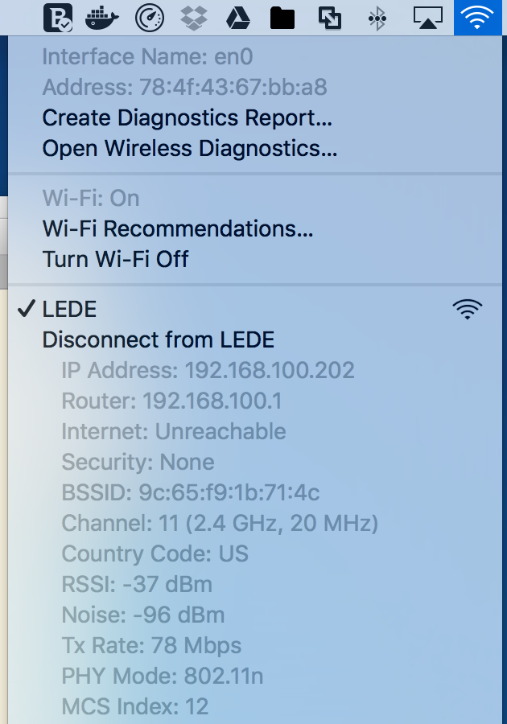

# linkit-smart-feed

* [Host environment](#host-environment)
* [Procedures](#procedures)
* [Screenshots](#screenshots)

This feeds holds everything a firmware of LinkIt Smart 7688 (Duo) needs to be
composed of.

## Host environment

The following operations have been tested on Ubuntu 16.04.2 LTS. For a Windows
or a Mac OS X host computer, you can install a VM for having the same
environment by:

* Downloading Ubuntu 16.04.2 LTS image from
    [http://www.ubuntu.com](http://www.ubuntu.com).
* Install this image with VirtualBox (http://virtualbox.org) on the host
    machine. 50GB disk space reserved for the VM is recommanded.

## Procedures

In Ubuntu system, open *Terminal* and execute the following commands:

1. Install prerequisite packages for building the firmware:

    ```sh
    sudo apt-get install git g++ make libncurses5-dev subversion libssl-dev \
        gawk libxml-parser-perl unzip wget python xz-utils
    ```

2. Get LEDE source code and this feed:

    ```sh
    cd /to/path/you/preferred
    git clone https://git.lede-project.org/source.git -b lede-17.01 linkit-smart-7688-lede
    git clone https://github.com/changyuheng/linkit-smart-7688-feed.git
    ```

3. Prepare the configuration file for feeds:

    ```sh
    cd linkit-smart-7688-lede
    cp ../linkit-smart-7688-feed/.lede/feeds.conf .
    ```

4. Update and install all feeds:

    ```sh
    ./scripts/feeds update -a
    ./scripts/feeds install -a
    ```

5. Prepare the configuration file for building system:

    ```sh
    cp ../linkit-smart-7688-feed/.lede/.config .
    ```

6. Start the compilation process:

    ```sh
    make -j4 V=99
    ```

    Release `N` in `-jN` with the number of your CPU thread count.
    Depending on the H/W resources of the host environment,
    the build process may **take more than 2 hours**.

7. After the build process completes, the resulted firmware file will be saved
   at `bin/targets/ramips/mt7688/lede-ramips-mt7688-LinkIt7688-squashfs-sysupgrade.bin`.

8. You can use this file to do the firmware upgrade through the Web UI.
   Or rename it to `lks7688.img` for upgrading through a USB drive.

## Screenshots




